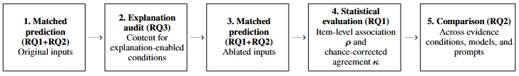

# LEX-EC: A Lexical Evidence-Channel Audit Framework for Zero-Shot LLM Personality Classification in Black-Box Settings


This package contains the code used for the experiments reported in
the LEX-EC: A Lexical Evidence-Channel Audit Framework for Zero-Shot LLM
Personality Classification in Black-Box Settings paper and accompanying appendix.

##Abstract
Large language models may easily assign personality labels from text, but model interpretability remains an open problem. To address this gap, we introduce LEX-EC, a reusable black-box audit framework combining agreement diagnostics with controlled lexical ablation to distinguish marginal-distribution effects from trait-associated signal recoverable under restricted evidence. Using this framework, we illustrate how various text genres may exhibit sharply different profiles: free-form essay text contains the broadest, but still weak, signal; in graduate student introductions, an observable Extraversion association weakened after masking; and single Facebook statuses yield little stable evidence even in a trait-balanced sample, indicating a possible lower bound of content or length. Masking topical and demographic content weakened some associations while leaving others detectable from function words, affective terms, and cognitive-style vocabulary. Linguistic prompting shifted model self-explanations but did not eliminate topical content. LEX-EC jointly evaluates item-level association and chance-corrected agreement, examines how both change under lexical restriction, and conducts a targeted audit of prompt sensitivity in model-generated explanations. Across datasets, models, and prompts, LEX-EC characterizes how trait associations may vary with available lexical evidence, introducing a novel application of lexical methods to black-box interpretability in personality labeling.

https://arxiv.org/abs/2607.24435

## Environment

The notebooks were run with Python 3.14.4.

Install the required packages with:

    pip install -r requirements.txt
    python -m spacy download en_core_web_trf

## Computing infrastructure

Preprocessing, ablation, API orchestration, and statistical analyses were
run on WSL2 on Windows10 using an AMD Ryzen 9 5900X 12-core Processor with 64 GB
of memory. While the system had a CUDA-capable GPU, it was not explicitly used in the experiments. As the LLM vendors are private companies, the provisioned hardware for these is unknown.

The authors note that the main performance bottlenecks were related not to the host system, but waiting for the LLM vendors to return outputs via the API. Please note that a single complete run over all configurations takes several hours.

## Execution order

Run the notebooks in this order:

1. `01-preprocessing.ipynb`
2. `02-text_analysis.ipynb`
3. `03-matched_prediction.ipynb`
4. `04-statistical_analysis.ipynb`

## Data

The experiments use the Pennebaker-King Essays dataset (Pennebaker and King 1999; Celli et al. 2013)  and the myPersonality dataset (Celli et al. 2013), as well as the private student introduction posts dataset, which is not provided due to IRB restrictions. The notebooks expect:

- `essays.csv`
- `mypersonality_final.csv`

These public datasets are provided in this repo for convenience, though please note that they are owned by the authors cited above and we do not claim ownership or copyright.

The student-introduction-post dataset associated code is commented out, but remains for illustrative purposes.

Preprocessing generates, in the root directory:

- `ESSAYS_fullset_text.csv`
- `ESSAYS_fullset_values.csv`
- `ESSAYS_subset_text.csv`
- `ESSAYS_subset_values.csv`
- `FACEBOOK_subset_text.csv`
- `FACEBOOK_subset_values.csv`

## API credentials

The '03-matched_prediction' notebook requires provisioning of:

- `OAI_KEY` (OPENAI_KEY)
- `ANTHROPIC_API_KEY`

## Outputs

Model predictions are saved in:

    personality_outputs/

Evaluation results are saved in:

    evaluation_results/

The prediction notebook checkpoints its output and resumes where it stopped automatically.

## Experimental configuration

- Random seed: 67
- Four prompt conditions
- Five model configurations
- Original and ablated text conditions
- One run per model/prompt/text configuration

Exact prompts, model snapshot identifiers, sampling procedures,
ablation rules, and evaluation metrics are provided in the notebooks, with deeper explanations available in the supplementary material and main paper.

## License

The original code in this repository is released under the MIT License.
Third-party datasets and software dependencies remain subject to their
respective licenses.

## Citation

If you use this code or framework, please cite:

```bibtex
@misc{harbison2026lexec,
  title         = {{LEX-EC}: A Lexical Evidence-Channel Audit Framework for
                   Zero-Shot {LLM} Personality Classification in Black-Box Settings},
  author        = {Harbison, Brittany and Goel, Ashok K.},
  year          = {2026},
  eprint        = {2607.24435},
  archivePrefix = {arXiv},
  primaryClass  = {cs.CL},
  url           = {https://arxiv.org/abs/2607.24435}
}
```

## References

- Pennebaker, J. W.; and King, L. A. 1999. Linguistic Styles: Language Use as an Individual Difference. Journal of Personality and Social Psychology, 77(6): 1296–1312.

- Celli, F.; Pianesi, F.; Stillwell, D.; and Kosinski, M. 2013. Workshop on Computational Personality Recognition: Shared Task. Proceedings of the International AAAI Conference on Web and Social Media, 7(2): 2–5.
